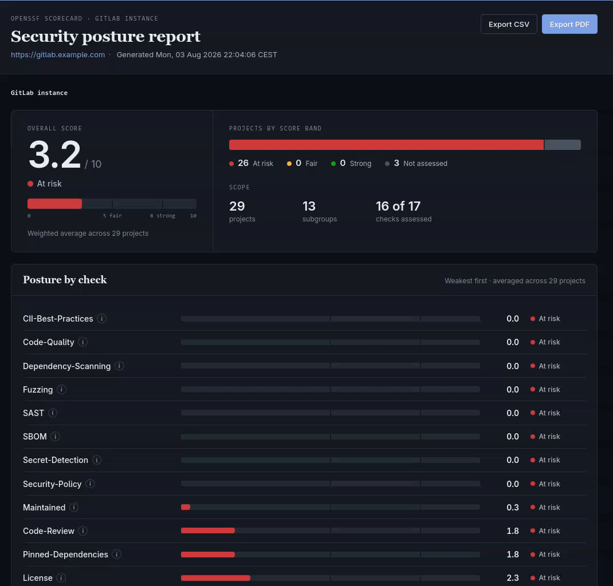

# kontrol

> Aggregated [OpenSSF Scorecard](https://github.com/ossf/scorecard) reporting across an entire self-hosted GitLab instance.

## What



`kontrol` walks every group, subgroup and project on a self-hosted GitLab instance, runs an [OpenSSF Scorecard](https://github.com/ossf/scorecard) analysis on each project, and rolls the results up into a single browsable HTML report. Instead of looking at one repo's score in isolation, you get:

- An **instance-level overview**: average score per Scorecard check, plus one overall average, across every project GitLab knows about.
- **Per-group and per-subgroup rollups**, computed the same way, so you can see which part of the org is lagging without opening every project.
- **Per-project detail**, down to individual Scorecard check results, at the leaves of the tree.

Aggregation is recursive: a group's numbers are the project-count-weighted average of its direct projects and its subgroups' (already-aggregated) numbers, all the way up to the instance root.

```
Instance (avg per check + overall)
└─ Group (avg per check + overall)
   ├─ Subgroup (avg per check + overall)
   │  └─ Project (raw Scorecard result)
   └─ Project (raw Scorecard result)
```

## How it works

1. **Discover**: list every project visible to the configured token via the GitLab API. Groups and subgroups are never fetched directly: they're inferred from each project's namespaced path (`team/backend/service` implies groups `team` and `team/backend`).
2. **Analyze**: run Scorecard against each project's repository, collecting a score per check (`Branch-Protection`, `Code-Review`, `Vulnerabilities`, etc.) plus Scorecard's own aggregate score. Scorecard is used as a Go library ([`github.com/ossf/scorecard`](https://github.com/ossf/scorecard)), not shelled out to.
3. **Aggregate**: average check scores bottom-up through the group tree (project → subgroup → group → instance).
4. **Render**: emit a single self-contained HTML report with a drill-down view: instance summary first, group → subgroup → project navigation, each level showing its own aggregated scores. The report can also export the full tree as CSV, or print a paginated PDF dossier of the whole instance straight from the browser.

### Offline mode

By default, `kontrol` only ever talks to your internal GitLab instance. All analysis is done on a local clone of each repository. A handful of Scorecard checks (`Vulnerabilities` via OSV.dev, `CII-Best-Practices` via bestpractices.dev, `Fuzzing`'s OSS-Fuzz status) additionally call out to public internet services regardless of where the repo is hosted, and run by default.

Set `scorecard.offline: true` (or `KONTROL_OFFLINE=true`) to disable that subset and restrict the run to checks that only need the local clone and the internal GitLab API, for fully airgapped environments with zero internet egress. Disabled checks are shown in the report as `N/A` rather than silently omitted.

## Supported checks

Scorecard ships more checks than GitLab actually supports: several rely on GitHub- or Azure DevOps-specific APIs and artifacts (release assets, webhooks, Actions workflow permissions) that have no GitLab equivalent. When `scorecard.checks` is left empty, kontrol requests every check marked ✅ below. Checks marked ❌ are silently dropped by Scorecard itself before the run (Scorecard's own check registry doesn't declare GitLab support for them), so they never appear in the report at all, not even as `N/A`. This is a structural Scorecard-for-GitLab limitation, not a kontrol bug. Checks marked ⚠️ work on GitLab but are opt-in: see [Experimental checks](#experimental-checks). Checks marked 🧩 are kontrol's own, computed directly from the GitLab API rather than run through Scorecard, since Scorecard's check registry excludes them for GitLab regardless of `scorecard.checks`. Unlike Scorecard's own checks, 🧩 checks are opt-in individually via the root-level `customScores` list; leaving it empty (the default) runs none of them, see below.

| Check | Runs on GitLab? | Notes |
| --- | --- | --- |
| Binary-Artifacts | ✅ | |
| Branch-Protection | ✅ | GitLab has no releases-to-commits-to-branches association; part of the scoring is skipped |
| CI-Tests | ✅ | |
| CII-Best-Practices | ✅ | Requires internet access (bestpractices.dev), shown `N/A` when `scorecard.offline: true` |
| Code-Review | ✅ | |
| Dependency-Update-Tool | ✅ | |
| Fuzzing | ✅ | Requires internet access (OSS-Fuzz), shown `N/A` when `scorecard.offline: true` |
| License | ✅ | |
| Maintained | ✅ | |
| Pinned-Dependencies | ✅ | |
| Security-Policy | ✅ | |
| Vulnerabilities | ✅ | Requires internet access (OSV.dev), shown `N/A` when `scorecard.offline: true` |
| Code-Quality | 🧩 | kontrol-native, not a Scorecard check. Scores whether recent successful default-branch pipelines upload a `codequality`-type artifact. **Not a security/SAST check**, see the `SAST` row below |
| Contributors | 🧩 | kontrol-native reimplementation (Scorecard's own registry still excludes GitLab). GitLab's API exposes no organization/company data, so this is a bus-factor/headcount proxy, not Scorecard's organizational-diversity measure |
| Dependency-Scanning | 🧩 | kontrol-native, not a Scorecard check. Scores whether recent successful default-branch pipelines upload a `dependency_scanning`-type artifact. Distinct from Scorecard's OSV.dev-based `Vulnerabilities` check and from having an SBOM (an inventory, not a scan) |
| SAST | 🧩 | kontrol-native reimplementation (Scorecard's own SAST check only recognizes GitHub's CodeQL/SonarCloud apps). Scores whether recent successful default-branch pipelines upload a `sast`-type artifact |
| Secret-Detection | 🧩 | kontrol-native, not a Scorecard check (Scorecard has no equivalent on any platform). Scores whether recent successful default-branch pipelines upload a `secret_detection`-type artifact |
| Dangerous-Workflow | ❌ | Analyzes GitHub Actions workflow syntax |
| Packaging | ❌ | Looks for GitHub Packages publish workflows |
| Signed-Releases | ❌ | Looks for GitHub release assets |
| Token-Permissions | ❌ | Analyzes GitHub Actions workflow token permissions |
| Webhooks | ❌ | GitHub-only per Scorecard's own check registry, despite the GitLab client implementing `ListWebhooks` |
| SBOM | ⚠️ | Runs on GitLab, but disabled by Scorecard unless `scorecard.experimental: true` (or `KONTROL_EXPERIMENTAL=true`) is set, see [Experimental checks](#experimental-checks) |

Code-Quality, Contributors, Dependency-Scanning, SAST, and Secret-Detection are gated by the root-level `customScores` setting, not by `scorecard.checks`/`scorecard.offline` (they call the same internal GitLab API already required for discovery, so offline mode doesn't affect them either):

```yaml
customScores: ["Code-Quality", "Contributors", "Dependency-Scanning", "SAST", "Secret-Detection"] # empty (the default) runs none of them
```

The four artifact-based checks (Code-Quality, Dependency-Scanning, SAST, Secret-Detection) sample the same window: the project's five most recent **successful** pipelines **on its default branch**. Both filters keep the score answering "does this project run the scanner" rather than "what happened to run last": an in-flight, canceled or skipped pipeline has no finished artifacts and would otherwise count against the project just for existing, and a burst of merge request or feature-branch pipelines that skip scanners would otherwise sink a project whose default branch runs them on every commit. A job that only ever runs on merge request pipelines is therefore not credited. All four are answered from a single pass over that window, so enabling them together costs no more API calls than enabling one.

Once enabled, each is shown as `N/A` only if the underlying GitLab API call itself fails for a given project, or (for the artifact-based ones) if the project has no successful default-branch pipelines to sample at all.

### Experimental checks

SBOM works against GitLab, but Scorecard itself gates it behind the `SCORECARD_EXPERIMENTAL` env var (checked inline in the check, not a documented flag), likely because it's newer/less stable upstream. Set `scorecard.experimental: true` (or `KONTROL_EXPERIMENTAL=true`) to opt in; kontrol sets `SCORECARD_EXPERIMENTAL` for you when that's on. Leave it off by default and treat SBOM results with a bit more scrutiny than the rest.

Webhooks is gated by the same env var upstream, but setting it won't help here: Scorecard's check registry declares Webhooks as GitHub-only (`repos: GitHub`), so it's dropped before the run regardless, the same structural exclusion as the ❌ checks above, not something kontrol can unlock.

## Requirements

- Go 1.26.5+ (only needed to build from source, see [Installation](#installation) for prebuilt options)
- Network access to the target GitLab instance's API
- A GitLab token with at least read access to the groups/projects you want scanned (`read_api` + `read_repository`)

## Installation

```bash
# From source
go install github.com/genesary/kontrol@latest

# Or grab a prebuilt binary (linux/windows/darwin, amd64/arm64) from the
# GitHub Releases page

# Or run the container image
podman run --rm -v ./config.yaml:/config.yaml:ro -v ./report:/report \
  ghcr.io/genesary/kontrol:latest scan --config /config.yaml
```

### Container notes

The image is built `FROM scratch` and runs as a non-root user (uid 1000): templates and CSS/JS are compiled into the binary, so those don't need mounting, but everything else does:

- **The config file is not baked into the image**, it must be mounted, e.g. `-v ./config.yaml:/config.yaml:ro`. `GITLAB_URL`/`GITLAB_TOKEN`/etc. env vars only override values in an already-loaded config file; they can't substitute for it entirely, so the container will fail immediately without one.
- **Only `/tmp` and whatever you mount are writable.** Every other directory in the image, including `/`, is root-owned and read-only to the `kontrol` user. Since the image sets no `WORKDIR`, the process's working directory is `/`, so a relative `output.path` like `./report` resolves to `/report`, which is why the example above mounts `-v ./report:/report` to match. If you change `output.path` in your config, either mount a volume at that same path or point it under `/tmp`, or the container will fail with a permission error creating the output directory.
- **No `git` binary is needed or present**, repositories are fetched via the GitLab API (tarball download), not `git clone`, so the scratch image doesn't need to (and doesn't) include one.

## Configuration

Both a config file and environment variables are supported; environment variables override the config file.

```yaml
# config.yaml
gitlab:
  url: https://gitlab.example.com
  token: ${GITLAB_TOKEN}
  filters: [] # optional; regexes OR'd against each project's full path (namespace/project)
customScores: [] # empty = no custom (🧩) checks; opt in by name, e.g. ["Code-Quality", "Contributors", "Dependency-Scanning", "SAST", "Secret-Detection"]
weights: {} # optional; check name -> integer weight, see below
scorecard:
  checks: [] # empty = all checks
  offline: false # true = disable checks requiring internet access
  experimental: false # true = also run Scorecard's SBOM check
  maxConcurrency: 5 # empty/0/negative = no concurrency limit
output:
  path: ./report
  formats: [] # empty = ["html"]; any combination of html, json, metrics
```

`gitlab.filters` restricts discovery to projects whose full path (e.g. `team/backend/service`) matches at least one of the given regular expressions; patterns are OR'd together, so a project is kept as soon as one matches. Leaving it empty (the default) scans every project the token can see. There is no env var override for it, since it's a list rather than a single value.

`customScores` opts in to kontrol's own 🧩 checks (see [Supported checks](#supported-checks)) by name, currently `Code-Quality`, `Contributors`, `Dependency-Scanning`, `SAST`, and `Secret-Detection`. Unlike `scorecard.checks`, an empty list (the default) runs *none* of them rather than all of them: these checks make extra GitLab API calls per project, so they stay opt-in. There is no env var override for it either.

`weights` maps a check name (any Scorecard check or one of the 🧩 custom checks) to an integer weight controlling how much it counts toward a project's overall score. A check with no entry defaults to weight `1`. A weight of `0` means the check is not run at all, whether it's a Scorecard check (as if left out of `scorecard.checks`) or a custom one (as if left out of `customScores`), so it's also omitted from the report entirely rather than shown as `N/A`. Leaving `weights` empty (the default) leaves the overall score exactly as Scorecard computes it today, via its own fixed risk-tier weighting, and custom checks stay excluded from that number. As soon as `weights` has at least one entry, kontrol switches to computing the overall score itself, as a weighted mean across every check that ran (Scorecard's and any enabled custom checks alike):

```yaml
weights:
  Vulnerabilities: 3 # counts 3x as much as an unweighted check
  Code-Quality: 0 # don't run this check at all
```

There is no env var override for it, since it's a map rather than a single value.

| Env var | Purpose |
| ------------------------- | -------------------------------------------------------------------------- |
| `GITLAB_URL` | Base URL of the self-hosted GitLab instance |
| `GITLAB_TOKEN` | API token used for discovery and repo access |
| `KONTROL_OFFLINE` | `true` to disable Scorecard checks that require internet access |
| `KONTROL_EXPERIMENTAL` | `true` to also run Scorecard's SBOM check |

`output.formats` selects which artifacts are written into `output.path`. All three are optional and independent:

| Format | File(s) | What it is |
| --- | --- | --- |
| `html` | `index.html` + `static/` | The browsable drill-down report |
| `json` | `results.json` | The full tree, machine-readable |
| `metrics` | `metrics` | Prometheus text exposition, ready to scrape |

Leaving `formats` empty (the default) writes the HTML report alone, matching kontrol's behaviour before the other formats existed. Names are case-insensitive and de-duplicated; an unknown name fails at config load rather than silently producing fewer files than expected. See [Output formats](#output-formats) for what `results.json` and `metrics` contain.

`scorecard.maxConcurrency` bounds how many projects are scanned by Scorecard at once, so a large instance doesn't overwhelm the GitLab API or the local machine. Leave it unset (or set it to `0` or a negative number) to scan every project's concurrently with no limit.

## Usage

```bash
kontrol scan --config config.yaml
```

This discovers, scans and renders in one pass, writing every artifact selected by `output.formats` (by default just the self-contained report directory: `index.html` plus its `static/` assets) to `output.path`. From the report, **Export CSV** downloads the full tree (every group/subgroup/project, per-check scores) as a spreadsheet-ready CSV, and **Export PDF** opens the browser's print dialog on a paginated dossier of the whole instance: cover page, executive summary, posture per check, group rollup, a per-project check matrix and any projects that could not be analyzed. The printed document always covers the entire instance, whichever group or project the reader has drilled into on screen.

The report's styling is built with [Tailwind CSS](https://tailwindcss.com/) from `internal/report/tailwind/input.css`. The compiled `internal/report/static/css/app.css` is committed, so a plain `go build` never needs Tailwind; only run `make frontend` if you edit the report's styles (it downloads the standalone Tailwind CLI into `./bin` on first use, no Node/npm required).

Logging is structured (via [zap](https://github.com/uber-go/zap)) and written to stderr at `info` level by default. Pass `-v`/`--verbose` (works on any subcommand) to switch to `debug` level, which also surfaces per-project scan detail and otherwise-hidden diagnostic output from dependencies (e.g. Scorecard's GitLab tarball fetch attempts):

```bash
kontrol -v scan --config config.yaml
```

## Output formats

Which of these are written is controlled by [`output.formats`](#configuration). They are rendered independently from the same in-memory tree, so enabling one never changes another.

### `results.json`

The full aggregated tree, wrapped in enough run metadata to stay self-describing once moved away from the run that produced it. Every level carries the same fields the HTML report shows: `score` (the project-count-weighted average and the number of projects behind it), the per-check `checks` map, `projectCount`, and `scanError` on any project that could not be analyzed. A check that ran but stayed inconclusive is `null` rather than `0`, matching the report's `N/A`.

```json
{
  "root": {
    "score": { "average": 6.42, "count": 118 },
    "checks": { "License": { "average": 9.1, "count": 118 }, "Fuzzing": null },
    "kind": "group",
    "name": "GitLab instance",
    "fullPath": "",
    "webUrl": "",
    "children": [ "..." ],
    "projectCount": 120
  },
  "generatedAt": "2026-08-28T15:20:00Z",
  "gitlabUrl": "https://gitlab.example.com",
  "schemaVersion": 1
}
```

Note that `score.count` is the number of projects that actually produced a score, which is lower than `projectCount` whenever some projects failed to scan.

`schemaVersion` is bumped whenever the layout changes meaning, so a consumer can detect an incompatible kontrol version instead of silently misreading it.

### `metrics`

Prometheus text exposition format, in a deliberately extensionless file: it is meant to be served as the body of a `/metrics` endpoint, or dropped into a [textfile collector](https://github.com/prometheus/node_exporter#textfile-collector) directory, rather than opened as a document.

```
# HELP kontrol_score Overall OpenSSF Scorecard score (0-10), aggregated project-count-weighted at group and instance level.
# TYPE kontrol_score gauge
kontrol_score{kind="instance",path=""} 6.42
kontrol_score{kind="group",path="team"} 5.9
kontrol_score{kind="project",path="team/backend/service"} 7.1

# HELP kontrol_check_score Per-check score (0-10), aggregated project-count-weighted at group and instance level.
# TYPE kontrol_check_score gauge
kontrol_check_score{kind="project",path="team/backend/service",check="License"} 10
```

| Metric | Labels | Meaning |
| --- | --- | --- |
| `kontrol_info` | `gitlab_url` | Always `1`; carries the scanned instance's URL |
| `kontrol_report_generated_at_seconds` | — | Unix timestamp of the scan, for staleness alerting |
| `kontrol_score` | `kind`, `path` | Overall score, 0-10 |
| `kontrol_check_score` | `kind`, `path`, `check` | Per-check score, 0-10 |
| `kontrol_projects` | `kind`, `path` | Projects contributing to this node's scores |
| `kontrol_scan_failed` | `kind`, `path` | `1` when the project could not be analyzed |

Every level of the tree is exposed, distinguished by `kind`: `instance` for the synthetic root (which has an empty `path`), `group` for each group and subgroup, `project` for each leaf. The rollups are kontrol's own project-count-weighted averages, so `kontrol_score{kind="group"}` matches the report exactly, unlike an `avg by (...)` computed in PromQL, which would weight every project equally regardless of how the tree is shaped.

Inconclusive scores are **omitted** rather than exported as zero: a check that could not run (offline mode, an unsupported repository) is genuinely absent, and a `0` would be indistinguishable from a real score of 0. Use `absent()` or `kontrol_scan_failed` to alert on those instead. Sample order is stable across runs over unchanged data.

Since the file is static, point a scraper at whatever serves `output.path`. With [Grafana Alloy](https://grafana.com/docs/alloy/latest/):

```alloy
prometheus.scrape "kontrol" {
  targets    = [{ __address__ = "kontrol-report.internal:8080", __metrics_path__ = "/metrics" }]
  forward_to = [prometheus.remote_write.default.receiver]

  // The file only changes when a scan runs, so there is nothing to gain
  // from scraping it at the default 60s interval.
  scrape_interval = "5m"
}
```

Or, if Alloy runs on the same host as the scan, skip the HTTP hop entirely and have kontrol write into the node_exporter textfile collector's directory (`output.path`) instead.

## Development

```bash
make build   # go build -> ./bin/kontrol
make test    # gotestsum with coverage -> codequality/
make lint    # golangci-lint
make frontend # rebuild internal/report/static/css/app.css from Tailwind source
make package # build the container image with podman (set DOCKER_ENGINE=docker to use Docker instead)
```

CI (`.github/workflows/go.yml`) runs the build, install, lint and test targets plus an OCI image build on every push and pull request against `main`. Tagged releases (`.github/workflows/release.yml`) publish a GitHub Release with a generated changelog, cross-compiled binaries for linux/windows/darwin (amd64/arm64), and a multi-tagged image to `ghcr.io/genesary/kontrol`.

## Roadmap

- [ ] CI-friendly mode (exit non-zero when the aggregated score falls below a configurable threshold)

## License

[MIT](LICENSE)
